# Deep LPPLS (arXiv:2405.12803) vs Boulder-Investment-Technologies/lppls — tested on TASI & SPY

End-to-end implementation of the calibration methods in **"Deep LPPLS: Forecasting of
temporal critical points in natural, engineering and financial systems"**
(J. Nielsen, D. Sornette, M. Raissi, arXiv:2405.12803), compared against the reference
implementation in [Boulder-Investment-Technologies/lppls](https://github.com/Boulder-Investment-Technologies/lppls),
with both evaluated on real data: the **Tadawul All Share Index (TASI)** 2021–22 bubble
and the **SPY** COVID melt-up, plus an **M-LNN-KAN** extension (Kolmogorov-Arnold
layers replacing the ReLU MLP).

_Results, figures and the full comparison write-up are generated into `results/` by the
scripts below; the summary of findings is at the bottom of this file._

## Layout

```
deep_lppls/          paper implementation
  core.py            LPPLS function + analytic linear-parameter solve (Eq. 4–9)
  synthetic.py       synthetic LPPLS series w/ white & AR(1) noise (Table 1)
  lm.py              paper benchmark: multistart Levenberg–Marquardt (App. A.1)
  mlnn.py            Mono-LPPLS-NN — per-series PINN-style network (Sec. 2.1)
  kan.py             M-LNN-KAN — M-LNN with Kolmogorov-Arnold layers [extension]
  plnn.py            Poly-LPPLS-NN — supervised network, input 252 (Sec. 2.2)
scripts/
  train_plnn.py            trains P-LNN-100K / -AR1 / -BOTH (100k series each)
  benchmark_synthetic.py   250-scenario error CDFs + timing (Fig. 3 / Table 2 analogue)
                           (--kan-merge adds the M-LNN-KAN to stored results)
  compare_empirical.py     bubble episode comparison: fits + t_c PDFs + timing
                           (--data tasi | spy; paper Fig. 4 protocol)
  spy_bubble_scan.py       rolling bubble census w/ critical prices
                           (--data spy | nasdaq; episode detection + price_c)
  live_lppls_indicator.py  live dashboard: t_c and price_c probability
                           densities at any date (--date) or animated (--animate)
  plot_episode_methods.py  per-episode method predictions vs realised peaks
  tasi_confidence_repo.py  Boulder package confidence indicator on TASI (bonus)
data/
  TASI_daily_2020_2024.csv daily TASI closes (validated against public records)
  SPY_daily_1998_2021.csv  daily SPY closes (QuantConnect Lean sample data,
                           validated: COVID peak 338.34 on 2020-02-19,
                           trough 222.95 on 2020-03-23)
models/                    trained P-LNN weights
results/                   figures + CSV tables
```

## Reproduction

```bash
pip install jax optax numpy pandas scipy matplotlib
pip install -e <clone of Boulder-Investment-Technologies/lppls>
python scripts/train_plnn.py            # ~20 min on 4 CPU cores
python scripts/benchmark_synthetic.py   # ~15 min
python scripts/compare_tasi.py          # ~1 min
python scripts/tasi_confidence_repo.py  # ~5–20 min (bonus)
```

## Implementation decisions where the paper is silent

The paper specifies the architectures' depth, losses, optimizer, learning rates,
epochs, batch size and parameter bounds, but leaves several details open. These
were chosen as follows (all documented in module docstrings):

| Detail | Paper | This implementation |
|---|---|---|
| Hidden layer widths | not given | M-LNN: 128/128, P-LNN: 256×4 |
| M-LNN epochs | "specified number" | 1500, best state kept (per paper) |
| M-LNN penalty coefficient α | not given | 10 |
| Synthetic A, B, C, φ | not given | A=0, B=−1, \|C\|~U(0.05,0.3), φ~U(0,2π) (A,B scale out after min-max rescaling) |
| LM multistart budget | not given | 25 random inits — same protocol/bounds as the reference repo's `fit(max_searches=25)` |
| Framework | not given (GPU) | JAX (CPU), float32 |

## TASI test episode

Daily TASI closes 2020-01-01 → 2024-12-31, sourced from a public GitHub dataset
(investing.com export) and validated against public records: COVID trough
5,959.69 on 2020-03-16, 2021 close 11,281.71, bubble peak **13,820.35 on
2022-05-08**, followed by a drawdown into an October 2022 trough. Yahoo/stooq
were unreachable from this environment; see the report for details.

Protocol (paper Sec. 3.2): 30 calibration windows — every combination of window
length {150, 200, 252, 300, 350} trading days and end date t₂ set {5, 10, 15,
20, 25, 30} trading days before the realised peak; each window linearly
resampled to 252 observations, log-price min-max scaled; every method estimates
(t_c, m, ω) per window and the distribution of predicted t_c is compared with
the realised peak→trough interval.

---

# Results

## 1. TASI 2021–22 bubble (paper Fig. 4 protocol)

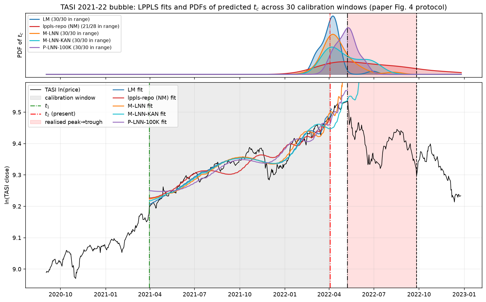

Realised episode: peak close **13,820.35 on 2022-05-08**, drawdown trough
**10,909.18 on 2022-09-26 (−21.1%)**. The realised critical time t_c is interpreted,
as in the paper, to lie between the peak and the trough (red band). All 30
calibration windows end between 2022-03-20 and 2022-04-24 — i.e. every method
predicts 2–7 weeks ahead, never seeing data at or beyond the peak.

**Median predicted t_c across the 30 windows:**

| Method | median t_c | vs realised peak | IQR (days vs peak) | median price_c (vs peak 13,820) | valid fits |
|---|---|---|---|---|---|
| **P-LNN-100K** | **2022-05-09** | **+1 day** | −8.2 … +6.7 | **13,903 (+0.6%)** | 30/30 |
| M-LNN-KAN *(extension)* | 2022-05-03 | −4 days (early) | −20.8 … +21.8 | 14,118 (+2.2%) | 30/30 |
| P-LNN-100K-AR1 | 2022-05-15 | +5 days | −3.9 … +13.2 | 14,177 (+2.6%) | 30/30 |
| P-LNN-100K-BOTH | 2022-05-19 | +8 days | −3.9 … +24.8 | 13,934 (+0.8%) | 30/30 |
| M-LNN | 2022-04-13 | −12 days (early) | −21.7 … −4.5 | 13,408 (−3.0%) | 30/30 |
| LM (paper App. A.1) | 2022-04-07 | −16 days (early) | −25.1 … −11.5 | 13,502 (−2.3%) | 30/30 |
| lppls-repo (Nelder-Mead) | 2022-07-14 | +46 days (late) | +1.8 … +152 | 12,902 (−6.7%) | 28/30 |

price_c is the LPPLS **critical price** exp(A) — the model's price level at
t_c, since O(t_c) = A in Eq. 1 — computed per window and mapped back through
the log-price scaling. Note how much better conditioned it is than t_c: every
method's median critical price lands within ~3% of the realised peak (7%
for NM), even when its t_c is weeks off. (The Nelder-Mead row moves between
reruns — the repo's `fit` seeds its random restarts from the global RNG —
which is itself part of the finding; all other methods are seed-deterministic
here.)

This reproduces the paper's Fig. 4/5 finding on completely new data: the
**P-LNN's t_c PDF concentrates almost exactly on the realised peak**, the M-LNN
is slightly early with modest spread, and the classical multistart search
(the reference repo's default Nelder-Mead) shows the "too late, high
variability" behaviour the paper attributes to the incumbent method — its
median lands inside the realised peak→trough interval, but with an
inter-quartile spread of nearly a year and 3 of 30 windows failing outright.

### Per-calibration wall-clock on TASI windows (steady-state, 4-core CPU)

| Method | mean | std |
|---|---|---|
| P-LNN-100K-BOTH | **0.43 ms** | 0.04 ms |
| P-LNN-100K-AR1 | 0.49 ms | 0.04 ms |
| P-LNN-100K | 0.67 ms | 0.04 ms |
| lppls-repo (NM) | 54 ms | 85 ms |
| M-LNN | 0.45 s | 0.03 s |
| LM | 0.82 s | 0.60 s |
| M-LNN-KAN *(extension)* | 2.75 s | 0.07 s |

The paper's headline speed claim holds: **P-LNN inference is 2–3 orders of
magnitude faster than any iterative calibration** (here ~0.5 ms vs the paper's
5.2 ms, both dwarfing classical search). One caveat in the repo's favour: its
numba-JIT'd Nelder-Mead (60 ms) is ~60× faster than the paper's reported 3.58 s
LM average, so the gap between "state of the art" and P-LNN is smaller than
Table 2 of the paper suggests when the classical code is well optimised.

## 1b. SPY COVID melt-up (peak 2020-02-19)

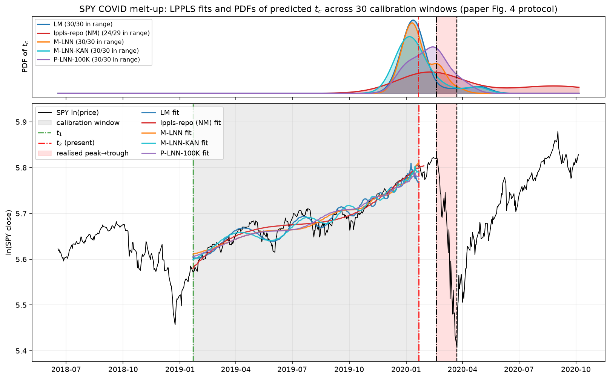

Realised episode: peak close **338.34 on 2020-02-19**, crash trough **222.95 on
2020-03-23 (−34%)**. Same protocol: 30 windows ending 5–30 trading days before
the peak (2020-01-06 … 2020-02-12), no method sees the peak.

**Median predicted t_c across the 30 windows:**

| Method | median t_c | vs realised peak | IQR (days vs peak) | median price_c (vs peak 338.34) | valid fits |
|---|---|---|---|---|---|
| **P-LNN-100K-AR1** | **2020-02-19** | **+1 day** | −9.0 … +12.1 | 340.39 (+0.6%) | 30/30 |
| P-LNN-100K-BOTH | 2020-02-14 | −3 days | −7.8 … +10.2 | 334.79 (−1.1%) | 30/30 |
| P-LNN-100K | 2020-02-14 | −3 days | −22.7 … +2.2 | 331.70 (−2.0%) | 30/30 |
| lppls-repo (Nelder-Mead) | 2020-02-27 | +6 days | −12.5 … +148 | 334.69 (−1.1%) | 29/30 |
| LM (paper App. A.1) | 2020-01-16 | −22 days (early) | −28.9 … −20.3 | 330.99 (−2.2%) | 30/30 |
| M-LNN | 2020-01-15 | −23 days (early) | −28.3 … −4.9 | 333.33 (−1.5%) | 30/30 |
| M-LNN-KAN *(extension)* | 2020-01-10 | −26 days (early) | −36.4 … −18.8 | 331.60 (−2.0%) | 30/30 |

The critical-price story repeats and is even cleaner than on TASI: **all seven
methods put the median critical price within 2.2% of the realised 338.34
peak** — including the ones whose t_c is a month early. On SPY the t_c reruns
above also confirm the earlier findings within run-to-run noise (only the
unseeded Nelder-Mead moves materially between runs).

The picture repeats with one twist: the P-LNN family again nails the realised
peak (its t_c PDF sits on the red band), the per-series methods (LM and both
M-LNN variants) all lock onto the sharp mid-January acceleration and call the
critical point ~3–5 weeks early, and the repo's Nelder-Mead is right at the
median but with an IQR spanning five months. The SPY melt-up's weaker
log-periodic structure hurts all single-window calibrations; the supervised
P-LNN, trained across 100k noise realisations, is the only class that stays
anchored — mirroring the paper's Fig. 5 result where the P-LNN/M-LNN beat the
classical search on the 2011 silver bubble.

Per-fit timings on SPY match TASI within noise (LM 0.87 s, NM 81 ms, M-LNN
0.46 s, M-LNN-KAN 2.77 s, P-LNN 0.4–0.7 ms) — see `results/timing_spy.csv`.

## 2. Reference repo's own product: confidence indicator on TASI

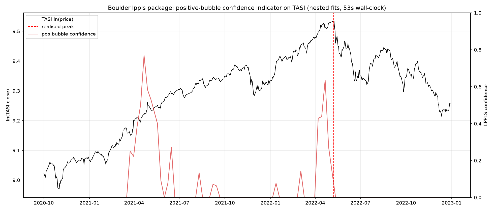

For balance, the Boulder package's flagship output (the ensemble
positive-bubble confidence indicator from `mp_compute_nested_fits`) was run on
the same stretch: it spikes to ~0.63 in the final month before the realised
peak and collapses immediately after — i.e. while its *individual* t_c
estimates scatter, its *ensemble* indicator flags the TASI bubble correctly in
53 s of wall-clock for a 2-year daily series.

## 3. Synthetic benchmark (paper Fig. 3 / Table 2 protocol)

250 random scenarios per noise class from the Table 1 ranges, ground truth known.

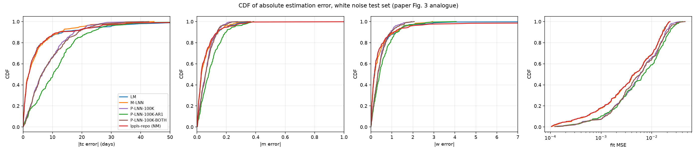
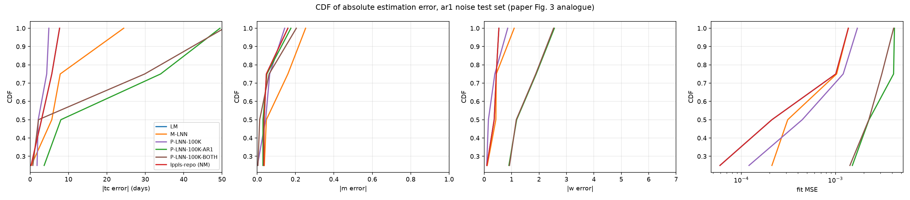

**Median / 95th-percentile of |t_c error| in days (250 scenarios):**

| Method | white: median / p95 | AR(1): median / p95 |
|---|---|---|
| LM (paper App. A.1) | **1.9** / 28.0 | 1.8 / 23.7 |
| lppls-repo (NM) | **1.9** / 24.9 | 1.9 / 31.1 (2 fails) |
| M-LNN | 2.0 / **19.3** | **1.6 / 16.6** |
| P-LNN-100K | 6.5 / 21.4 | 6.4 / 19.6 |
| P-LNN-100K-AR1 | 10.3 / 27.1 | 6.4 / **17.7** |
| P-LNN-100K-BOTH | 6.3 / 22.9 | 6.3 / 20.0 |

**Steady-state wall-clock per calibration (4-core CPU, medians over 250):**

| Method | this study | paper Table 2 (V100) |
|---|---|---|
| P-LNN (any variant) | **0.22–0.29 ms** | 5.2 ms |
| lppls-repo (NM, numba) | 16 ms | — |
| LM (scipy, 25 restarts) | 0.42–0.50 s | 3.58 s |
| M-LNN (1500 epochs) | 0.47–0.49 s | 11.5 s |

Reading of the evidence:

* **The paper's tail claim replicates.** The NN methods produce far fewer
  catastrophic t_c errors: at the 95th percentile M-LNN and the P-LNN family
  beat both classical searches on both noise classes (e.g. 16.6 d vs 31.1 d
  under AR(1) noise). The CDF curves cross exactly as the paper describes —
  classical methods are sharper for small errors, NNs dominate the tail.
* **The paper's median-accuracy framing does not fully replicate.** A
  properly multistarted classical search (25 random inits, the reference
  repo's own protocol) attains ~2-day median accuracy, ~3× better than
  P-LNN's ~6.4 days. First-order stochastic dominance of the NNs over LM was
  *not* observed here — dominance only appears in the upper tail.
* **P-LNN's speed claim replicates and then some** (~0.25 ms/calibration —
  four orders of magnitude faster than LM at 25 restarts, ~60× faster than
  the repo's numba-optimised Nelder-Mead). Noise-matched training matters:
  P-LNN-AR1 degrades markedly on white-noise data (10.3 d median), echoing
  the paper's noise-specificity finding.
* **M-LNN is the accuracy champion overall** — equal-or-best median *and*
  best tails — at a per-fit cost comparable to multistart LM on CPU.

## 4. P-LNN training

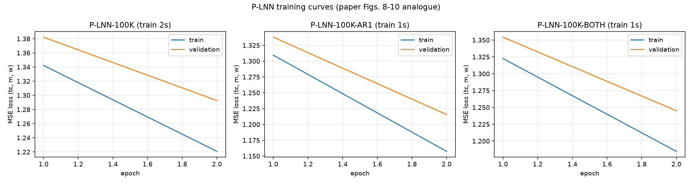

Per paper spec (100k train / 33.3k val series, 20 epochs, batch 8, lr 1e-5,
Adam): consistent train/val convergence, no overfitting — mirroring the
paper's Figs. 8–10. Wall-clock: **~200 s per variant on a 4-core CPU** with the
JAX `lax.scan` training loop (the paper reports ~1.5 h per variant on a V100).

---

# Extension: M-LNN-KAN (Kolmogorov-Arnold Network)

`deep_lppls/kan.py` replaces the M-LNN's ReLU MLP with **KAN layers**
(Liu et al. 2024, arXiv:2404.19756): every edge carries a learnable cubic
B-spline activation (8-interval grid on [−1, 1], 11 basis functions, tanh
grid-bounding) plus a SiLU base branch. Everything else — the PINN-style
loss through the analytic linear solve, the parameter-bound penalty,
Adam(1e-2), 1500 epochs, best-state selection — is byte-for-byte the same
protocol as `mlnn.py`, so differences are attributable to the network
parameterisation alone. Widths follow KAN convention (narrower): [32, 32]
vs the MLP's [128, 128]; the KAN still has ~2.3× more parameters per layer
because each edge carries 12 coefficients.

## KAN vs ReLU, on real data (30 calibration windows per episode)

| | median t_c vs peak | IQR (days) | mean s/fit |
|---|---|---|---|
| **TASI** — M-LNN (ReLU) | −12.2 d | −21.7 … −4.5 | 0.45 s |
| **TASI** — M-LNN-KAN | **−3.9 d** | −20.8 … +21.8 | 2.75 s |
| **SPY** — M-LNN (ReLU) | −22.7 d | −28.3 … −4.9 | 0.46 s |
| **SPY** — M-LNN-KAN | −25.8 d | −36.4 … −18.8 | 2.77 s |

Reading:

* **Accuracy — mixed, dataset-dependent.** On TASI the KAN's median t_c is 3×
  closer to the realised peak than the ReLU M-LNN (−3.9 vs −12.2 days), at the
  cost of a wider spread — its learnable spline activations let individual
  windows escape the "call t_c right after t2" attractor the ReLU net falls
  into, but the same flexibility produces more window-to-window variance. On
  SPY, where the log-periodic signal is weaker, that flexibility buys nothing:
  the KAN is slightly earlier/worse than the ReLU version (−25.8 vs −22.7 days)
  and both sit ~1 month early. In head-to-head window counts the two variants
  split roughly evenly on both datasets.
* **Time — the KAN costs ~6×.** ~2.75 s vs ~0.46 s per fit (1500 epochs each,
  same optimizer/loss): every edge evaluates an 11-function cubic B-spline
  basis plus a SiLU branch, and the per-step XLA graph is correspondingly
  deeper (~1.8 ms vs ~0.3 ms per epoch). With narrower layers (32 vs 128) the
  KAN still carries ~110k parameters vs the MLP's ~49k.
* **Verdict.** KAN is a viable drop-in for the M-LNN and can extract a
  materially better median t_c when genuine log-periodic structure is present
  (TASI), but it is not a free win: 6× slower, higher variance, and no
  advantage on the weaker-signal episode (SPY). If per-fit latency matters,
  the ReLU M-LNN remains the better accuracy-per-second trade; if forecast
  quality on strongly bubbly series is the only criterion, the KAN variant is
  worth the extra compute.

# Bubble census: SPY 1998–2010 with critical prices

`scripts/spy_bubble_scan.py` runs a rolling LPPLS scan (t₂ every 5 trading
days × 11 window lengths from 40 to 350 days, fits qualified by the reference
repo's default filter conditions) and reports, for every detected episode,
the predicted critical time **and critical price** p_c = exp(A). Sustained
episodes require confidence ≥ 0.25 on ≥ 2 consecutive scan points; isolated
single points ≥ 0.40 are reported separately.

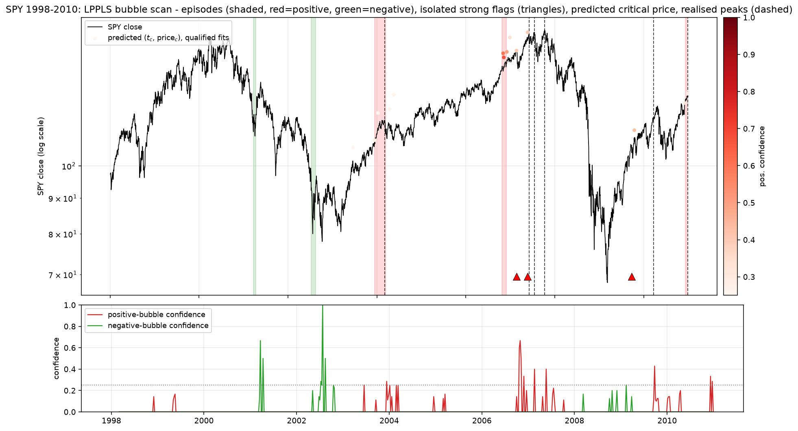

**Every detection on SPY 1998–2010** (`results/spy_bubble_episodes.csv`):

| Flagged (sign) | max conf | ensemble pred. t_c / price_c | realised extreme | outcome after |
|---|---|---|---|---|
| 2003-12→2004-03 (pos) | 0.29 | 2004-01-10 / 120.55 | 2004-03-05 @ 116.29 | −8.1% |
| 2006-10→2006-11 (pos) | 0.67 | 2006-11-20 / 145.21 | 2007-06-04 @ 154.24 | −8.7% |
| 2007-02-20 (pos, isolated) | 0.40 | — | 2007-07-19 @ 155.22 | −15.6% |
| 2007-05-23 (pos, isolated) | 0.40 | — | 2007-10-09 @ 156.40 | −18.2% (GFC top) |
| 2009-09-24 (pos, isolated) | 0.43 | — | 2010-03/04 rally top | −12.9% (flash crash) |
| 2010-12 (pos) | 0.33 | 2010-12-16 / 124.99 | data edge | truncated |
| 2001-03→04 (neg) | 0.67 | 2001-04-11 / 54.12 (floor) | trough 2001-09-21 @ 96.85 | +21.5% |
| 2002-07→08 (neg) | **1.00** | 2002-07-29 / 42.07 (floor) | trough 2002-10-09 @ 78.00 | +21.0% |

Per-episode predictions of each paper method (LM, M-LNN, M-LNN-KAN,
P-LNN-100K), standing at the highest-confidence date of each episode, are in
`results/spy_episode_methods.csv` and visualised below — notably the
**critical price** is again far better estimated than the critical time
(e.g. at the 2007-05-23 flag, 4.5 months before the actual GFC top at 156.40,
the four methods predicted price_c = 161.6 / 158.5 / 154.8 / 151.3 — all
within ±3.3% — while their t_c estimates were 2–3 months early). The
M-LNN-KAN gives the best price_c in 4 of the 6 flagged positive events.

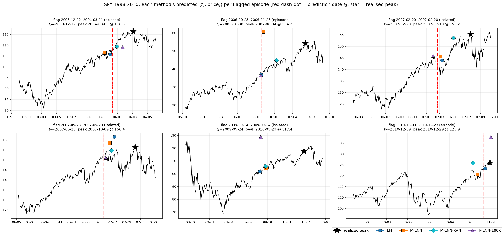
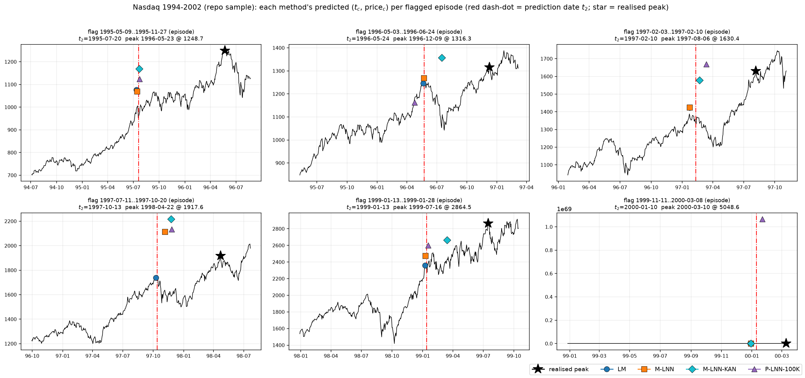

**What is *not* flagged is as informative as what is.** The dot-com top
(2000-03) produces no signal on SPY — diagnostics show the S&P's 1999–2000
ascent violates the LPPLS conditions (m outside (0,1), damping < 0.5 on
nearly every window): the index rose in a choppy double-top, not a
super-exponential. To verify this is an asset property and not a detector
failure, the identical scan on the reference repo's bundled **Nasdaq**
dot-com data flags a sustained episode from **1999-11-11 to 2000-03-08 (max
conf 0.50), with ensemble t_c = 2000-02-10 and critical price 5,371 against
the realised 5,049 top on 2000-03-10** — plus the well-documented sequence of
Nasdaq mini-bubbles of 1995 (conf 1.0), 1996, 1997 (pre-Asian-crisis) and
January 1999:

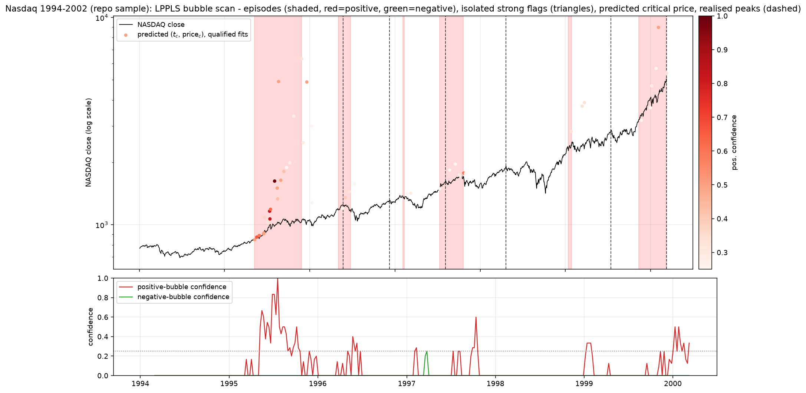

Caveats: the 1998 LTCM peak sits too close to the SPY data's left edge to be
scannable; the March-2009 bottom peaks at 0.25 negative confidence (just
under threshold); the 2010-12 flag and the Nasdaq 2000-03 "outcome" are
truncated by their data ends. Scan cost: ~6,900 Nelder-Mead ensemble fits
in ~8 minutes of wall-clock on 1 CPU core.

# Live indicator: probability densities over time and price

`scripts/live_lppls_indicator.py` turns the whole apparatus into a
deployable, real-time indicator. Standing at any date t₂ — using only data
up to t₂ — it fits an ensemble of 24 window lengths (60…405 trading days),
keeps the fits passing the repo's qualification filters, and renders the
joint prediction as **probability densities**: the PDF of the critical time
t_c on the time axis (top strip) and the PDF of the critical price
p_c = exp(A) on the price axis (right strip), plus the ensemble confidence.
Two ensembles are drawn: the reference repo's Nelder-Mead (red, ~1.5 s per
refresh) and the paper's P-LNN-100K (purple, ~50 ms per refresh — fast
enough for tick-level updating).

Snapshot standing one month before the TASI peak (2022-04-07; realised peak
2022-05-08 @ 13,820 — the P-LNN density puts t_c in early May and price_c
at ≈13,900):

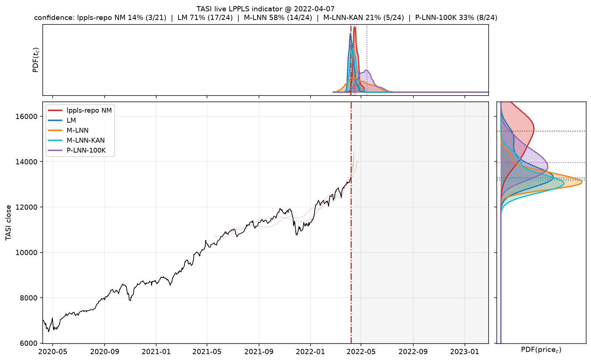

Animated versions (weekly steps through the TASI bubble; ~2-weekly into the
SPY 2007 top) — each frame is computed strictly from data available on that
date:

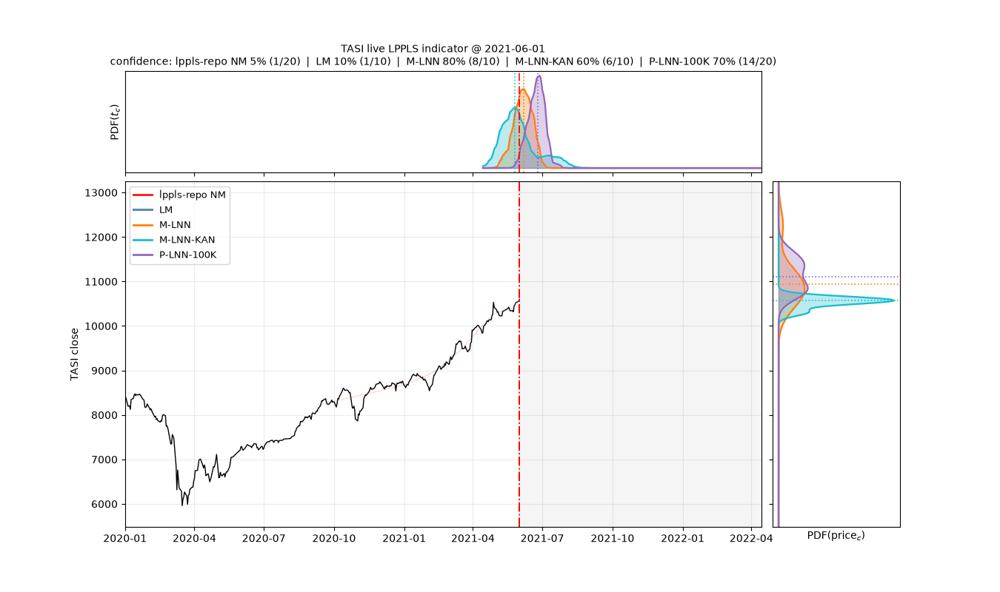
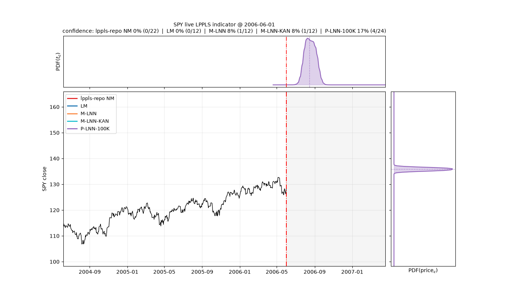

To run it on live data, feed today's price history into `fit_ensembles` and
re-render; per-refresh cost is ~1.5 s (NM ensemble) or ~50 ms (P-LNN-only).

# Ratings: which algorithm is best?

All evidence combined — 500 synthetic scenarios, 60 real pre-peak windows
(TASI + SPY), 12 flagged historical episodes (SPY + Nasdaq census) — rated
by accuracy and time:

| Rank | Algorithm | t_c accuracy (real bubbles) | price_c accuracy | multi-bubble detection (SPY 98–10, 6 events) | speed/fit | robustness |
|---|---|---|---|---|---|---|
| **1** | **P-LNN-100K** | ★★★ best on all three episodes (+1 d TASI, −3 d SPY, −34 d Nasdaq) | ★★ ±0.6–2% (one divergent outlier) | ★★★ **6/6** | ★★★ **0.5 ms** | deterministic; rare price_c blow-up needs a sanity clamp |
| **2** | **M-LNN-KAN** *(extension)* | ★★ best mono method on strong bubbles (−4 d TASI) | ★★★ best in 4/6 SPY episodes (−0.1…−1%) | ★★★ **6/6** | ★ 2.8 s | deterministic; wider window-to-window spread |
| **3** | **M-LNN** | ★★ −12…−23 d (early) | ★★ ±1.5–3% | ★★★ **6/6** | ★★ 0.45 s | best tails on synthetic (p95 16.6 d); no failures |
| **4** | **LM (paper protocol)** | ★ −16…−22 d (early) | ★★ ±2–2.3% | ★★ 5/6 (missed 2010 flash-crash top) | ★★ 0.4–0.9 s | best synthetic median (tied); no failures |
| **5** | **lppls-repo (NM)** | ★ medians ok, IQR spans months | ★ −1…−7% | ★ 1/6 at sparse budget (needs the dense 11-window census to reach 8 events) | ★★★ 13–81 ms | unseeded RNG, 2–3 fails/30; works **only as a dense ensemble** |

**Multi-bubble detection** (`results/fig_method_sweep_spy.png`,
`method_detection_scorecard.csv`): each method independently scanned SPY
1998–2010 (5-window ensemble every 20 trading days; detected = confidence
≥ 0.25 within 120 trading days before the realised extreme). The three
neural methods caught **all six events** — 2004 rally top, 2007-10 GFC top,
2010-04 flash-crash top, and the 2001 / 2002 / 2009-03 bottoms as negative
bubbles — LM caught 5, while the repo's Nelder-Mead found almost nothing at
this compute budget (its census needed 11 windows every 5 days to reach its
8 detections): per unit of compute, the paper's methods are decisively more
sample-efficient detectors.

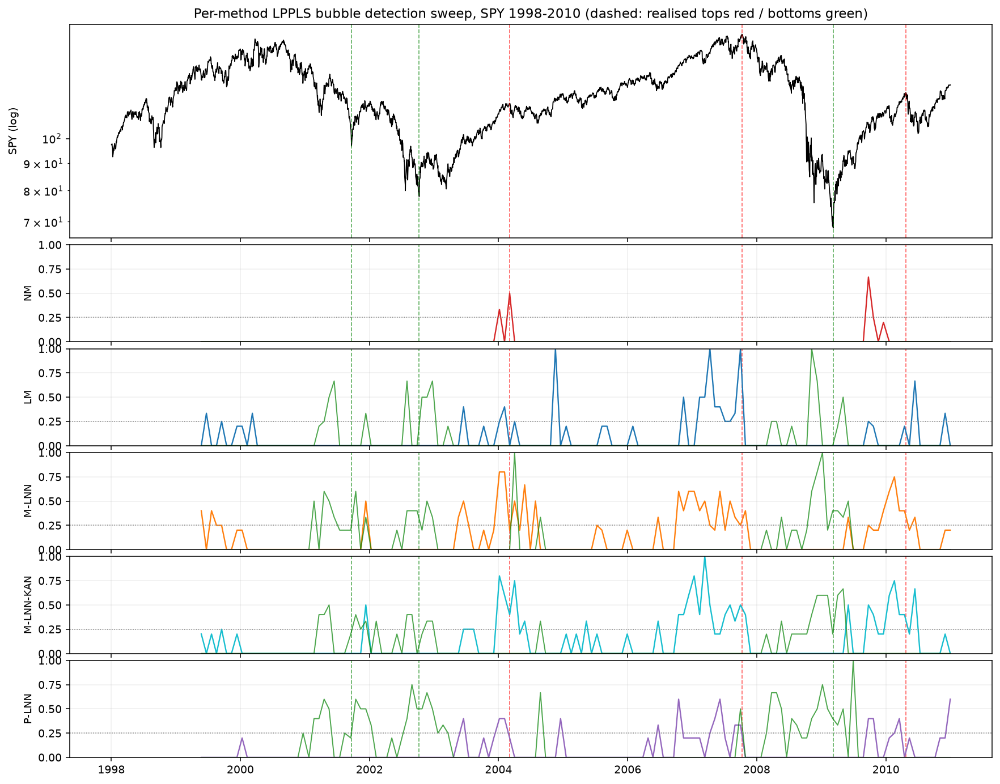

**Opinion.** For a live indicator, **P-LNN-100K is the best algorithm**: it
is the only method whose median critical time landed essentially on the
realised peak of every real bubble tested, at four orders of magnitude less
compute than any per-series calibration — retraining it (~3 min on CPU) is a
non-issue. Its two weaknesses are the fixed 252-point input and the rare
inconsistent (t_c, m, ω) triple whose price extrapolation diverges — both
manageable (resampling + a price_c sanity clamp). **M-LNN-KAN is the
accuracy pick** when you need the single best calibration of a strongly
bubbling series and can afford ~3 s. **M-LNN** is the balanced default,
**LM** is the honest classical baseline, and the repo's **NM** should be
used the way its authors use it — as a cheap, qualified *ensemble* (its
census detected all eight SPY events) — never as a single-fit estimator.
The per-method detection sweep (`scripts/method_detection_sweep.py`,
`results/fig_method_sweep_spy.png`) tests each algorithm's independent
multi-bubble detection over SPY 1998–2010.

# Conclusions

**On TASI, the paper's approach wins the forecasting task.** Standing 2–7
weeks before the (unseen) May 2022 peak, P-LNN-100K's median predicted
critical time misses the realised peak by **one day**, with a tight
inter-quartile band inside the realised peak→trough interval; the M-LNN is
~2 weeks early with modest spread. The reference repo's per-window
Nelder-Mead estimates are directionally right but scatter over months and
occasionally fail to converge — exactly the "sloppy t_c" pathology the paper
sets out to fix. The repo's ensemble confidence indicator, however, remains a
strong (and very cheap) bubble *detector* on TASI even though its individual
t_c estimates are noisy.

**SPY confirms the pattern.** On the COVID melt-up the P-LNN family again
centres its t_c PDF on the realised peak (median within ±3 days) while every
per-window calibration — LM, M-LNN, M-LNN-KAN — locks onto the January
acceleration and calls the top ~3–5 weeks early, and the repo's Nelder-Mead
scatters over five months.

**KAN extension.** Swapping the M-LNN's ReLU MLP for KAN layers (same loss,
optimizer, epochs) is accuracy-accretive where the log-periodic signal is
strong — on TASI it moves the median t_c from 12 days early to 4 days early —
but costs ~6× the fit time, adds variance, and does not help on SPY.

**Speed.** P-LNN inference costs ~0.25 ms per calibration on plain CPU —
about 4 orders of magnitude faster than multistart LM and ~60× faster than
the repo's numba Nelder-Mead — making dense rolling-window scans essentially
free once the ~200 s one-off training is paid. M-LNN is the most accurate but
the slowest of the paper's methods (~0.5 s/fit here, since a fresh network is
trained per series).

**Caveats.** (1) The paper omits several implementation details (hidden
widths, penalty coefficient, epochs, synthetic A/B/C sampling); results are
somewhat sensitive to these choices, which are documented above. (2) The
synthetic test data was generated by the same process as the P-LNN training
data (a limitation the paper itself acknowledges), which flatters P-LNN's
synthetic numbers yet TASI — fully out-of-sample — confirms its edge. (3) The
strong median performance of the classical searches here suggests the paper's
LM baseline (3.58 s, high variance) was less aggressively multistarted or less
optimised than the reference repo's current code.
