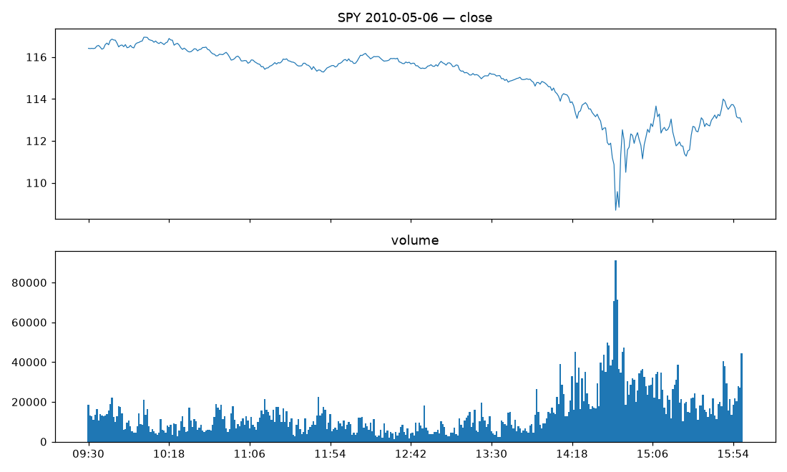
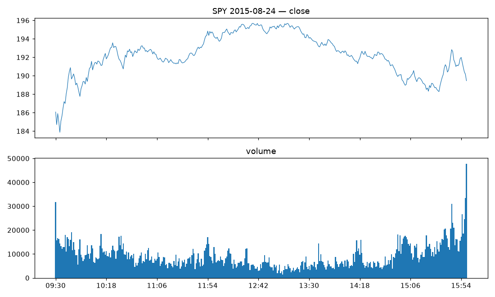
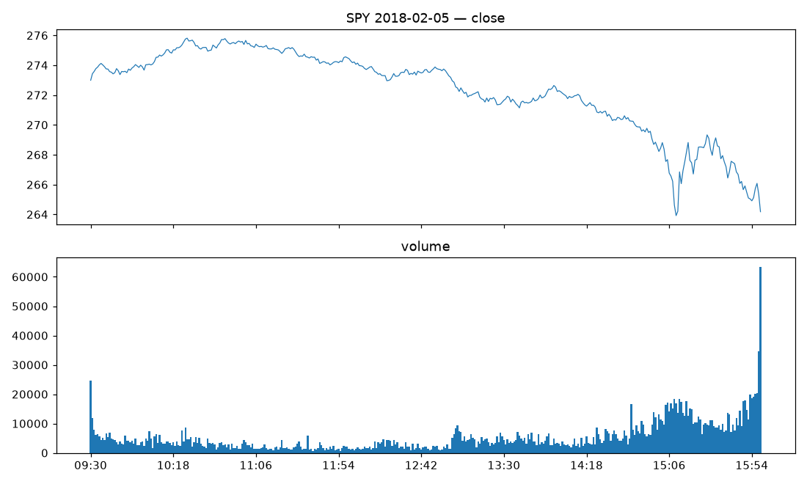
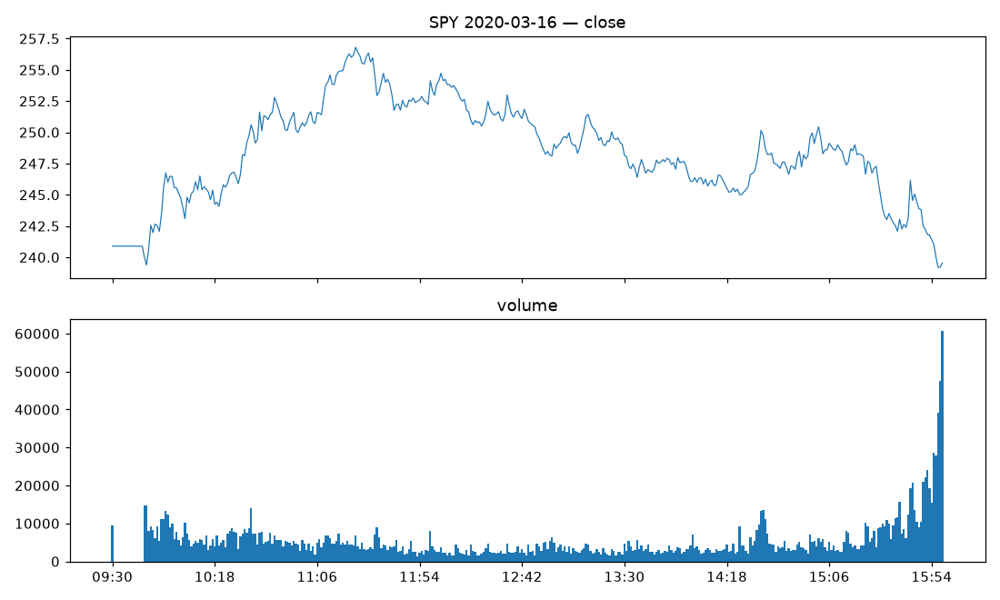

# Data audit — SPY 1-min (Phase 0)

Source: `kaggle:gratefuldata/intraday-stock-data-1-min-sp-500-200821 (CC0)`  
Zip SHA-256: `8bd52867b248359db437f2fd809ac1faafc3f69449679aae9d499423487ccd5e`

## Provenance / integrity

- CSV rows: 2,070,834; exact-duplicate re-export rows dropped: 638,054 (loader hard-fails on any duplicated timestamp with conflicting values — none found).
- Data span: 2008-01-22 → 2021-05-06 (note: coverage ends April 2021, not year-end).

## Timezone / clock

- Unique-timestamp rows: 1,432,780; bars/day before RTH slice: median 390, max 960 (extended-hours bars present on a minority of days; discarded).
- Inferred file-clock offset vs ET: **-2 h** (start of the max-total-volume 390-minute window = RTH block), matches config (-2 h). Normalization verified, hard-fail armed.
- DST consistency: modal first bar = 09:30 ET in 100.0% of months (file clock follows ET DST at a fixed offset).
- 2010-05-06 flash-crash trough at **14:45 ET** (expected ~14:45) — offset confirmed on independent evidence.

## Calendar coverage

- NYSE sessions in span: 3,347; sessions with data: 3,347; sessions entirely absent: 0; non-session ghost days removed: 0.
- Half days (early close 13:00 ET) in span: 29 — all dropped per contract.

## Missing minutes (full days)

|   year |   days |   total_missing |   max_missing |   days_with_gaps |
|-------:|-------:|----------------:|--------------:|-----------------:|
|   2008 |    237 |               0 |             0 |                0 |
|   2009 |    250 |             105 |           105 |                1 |
|   2010 |    251 |               0 |             0 |                0 |
|   2011 |    251 |               0 |             0 |                0 |
|   2012 |    247 |               0 |             0 |                0 |
|   2013 |    249 |              38 |            38 |                1 |
|   2014 |    249 |               0 |             0 |                0 |
|   2015 |    250 |               0 |             0 |                0 |
|   2016 |    251 |               0 |             0 |                0 |
|   2017 |    249 |               0 |             0 |                0 |
|   2018 |    248 |               0 |             0 |                0 |
|   2019 |    249 |               0 |             0 |                0 |
|   2020 |    251 |               0 |             0 |                0 |
|   2021 |     86 |               0 |             0 |                0 |

## Exclusion rules (ex ante)

- Included days: **3,316** of 3,347; exclusions by reason: {'half_day': 29, 'morning_gaps': 2}.
- SSL-pretrain era ['2008-01-01', '2010-12-31']: **737** days; supervised era ['2011-01-01', '2021-12-31']: **2,579** days.

## Outliers

- 1-min log-return prints > 20 robust-σ: 14 (worst days: [('2013-09-18', 52.711856829242684), ('2013-04-23', 31.854853435303372), ('2019-07-31', 26.73947597637819), ('2010-05-06', 25.25664104351596), ('2019-09-18', 23.8403742189849)]).
- Negative-volume bars: 0; zero-volume bars: 286.

## Adjustment status

- **Decisive price-level anchor: unadjusted** — median early-2008 close 135.33 over 28 days (SPY's actual unadjusted level was ~120-148; a dividend-back-adjusted series would sit ~95-115).
- Supporting ex-div signature: adjusted_or_no_signal — overnight return on candidate ex-div dates (3rd Fri of Mar/Jun/Sep/Dec incl. holiday shifts, n=54) minus other days: mean -18.9 bp / median -25.2 bp (ex-div -16.9 bp vs other 2.0 bp).
- Policy: unadjusted prices for dollar bars/execution; r_on gets an explicit dividend correction from SPY distribution history in Phase 1 (the weak/noisy ex-div mean is expected at n≈52 with 60-100 bp overnight vol; the price anchor is the classification).

## Volume units

- Median daily-sum ratio to reference share volume: 0.0076 → multiplier **×100** (IB lots of 100).

## Label balance by year (included days; y = sign of 15:30→close log return)

|   year |   n |   n_up |   n_down |   n_flat |   mean_bp |   std_bp |
|-------:|----:|-------:|---------:|---------:|----------:|---------:|
|   2008 | 237 |    123 |      109 |        5 |     -1.57 |    94.76 |
|   2009 | 249 |    127 |      119 |        3 |      1.89 |    47.43 |
|   2010 | 251 |    141 |      107 |        3 |      1.59 |    28.07 |
|   2011 | 251 |    131 |      114 |        6 |      0.47 |    41.55 |
|   2012 | 247 |    119 |      123 |        5 |      0.15 |    19.08 |
|   2013 | 248 |    124 |      117 |        7 |     -1.09 |    18.07 |
|   2014 | 249 |    132 |      113 |        4 |     -1.02 |    16.22 |
|   2015 | 250 |    117 |      128 |        5 |     -0.87 |    23.68 |
|   2016 | 251 |    136 |      113 |        2 |      0.54 |    16.54 |
|   2017 | 249 |    122 |      123 |        4 |     -0.81 |    10.48 |
|   2018 | 248 |    118 |      126 |        4 |     -2.24 |    31.75 |
|   2019 | 249 |    128 |      119 |        2 |      0.94 |    18.03 |
|   2020 | 251 |    117 |      134 |        0 |      0.77 |    67.13 |
|   2021 |  86 |     36 |       49 |        1 |     -3.3  |    25.49 |

## Event-day panels

- 2010-05-06: 
- 2015-08-24: 
- 2018-02-05: 
- 2020-03-16: 

## Artifacts

- `data/interim/spy_rth_et.parquet` — cleaned tz-aware RTH bars (unadjusted prices, raw volume units).
- `data/interim/day_classification.parquet` — per-day include/exclude with reason.
