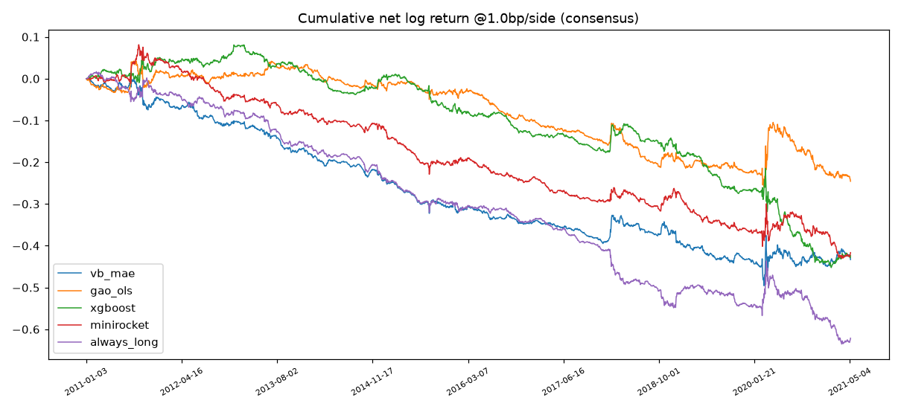
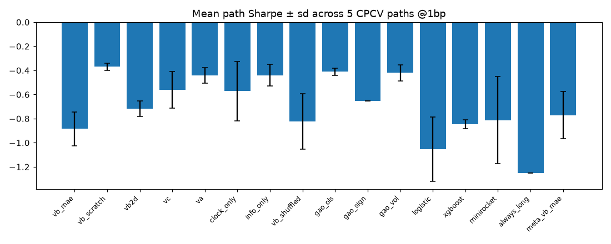

# Results — SPY dual-time 3D CNN (PILOT)

**Overall verdict: NULL (honest).** Registry: 16 trials (effective trials from return-correlation spectrum: 3.7); CSCV PBO (S=8): **0.53**; headline cost 1.0 bp/side.

## Trial table (5 CPCV paths, net @1bp)

| trial | hit | AUC | mean path Sharpe ± sd | path Sharpes | DSR | Sortino | maxDD | exposure |
|---|---|---|---|---|---|---|---|---|
| vb_mae | 0.504 | 0.510 | -0.89 ± 0.14 | [-0.967, -0.626, -0.957, -1.027, -0.847] | 0.00 | -1.06 | 0.501 | 1.00 |
| vb_scratch | 0.500 | 0.520 | -0.37 ± 0.03 | [-0.337, -0.411, -0.337, -0.367, -0.397] | 0.03 | -0.48 | 0.379 | 1.00 |
| vb2d | 0.493 | 0.526 | -0.72 ± 0.06 | [-0.623, -0.721, -0.789, -0.672, -0.781] | 0.00 | -0.88 | 0.415 | 1.00 |
| vc | 0.505 | 0.515 | -0.56 ± 0.15 | [-0.552, -0.797, -0.464, -0.646, -0.355] | 0.00 | -0.81 | 0.423 | 1.00 |
| va | 0.500 | 0.522 | -0.44 ± 0.06 | [-0.493, -0.529, -0.349, -0.411, -0.427] | 0.00 | -0.73 | 0.404 | 1.00 |
| clock_only | 0.494 | 0.525 | -0.57 ± 0.25 | [-0.546, -0.808, -0.836, -0.524, -0.149] | 0.01 | -0.62 | 0.393 | 1.00 |
| info_only | 0.498 | 0.518 | -0.44 ± 0.09 | [-0.535, -0.335, -0.414, -0.557, -0.365] | 0.02 | -0.52 | 0.373 | 1.00 |
| vb_shuffled | 0.513 | 0.522 | -0.82 ± 0.23 | [-0.778, -1.165, -0.991, -0.68, -0.506] | 0.00 | -1.06 | 0.446 | 1.00 |
| gao_ols | 0.503 | 0.522 | -0.41 ± 0.03 | [-0.438, -0.442, -0.366, -0.42, -0.388] | 0.01 | -0.68 | 0.302 | 1.00 |
| gao_sign | 0.505 | 0.504 | -0.65 ± 0.00 | [-0.654, -0.654, -0.654, -0.654, -0.654] | 0.00 | -0.89 | 0.388 | 1.00 |
| gao_vol | 0.501 | 0.514 | -0.42 ± 0.07 | [-0.448, -0.52, -0.43, -0.328, -0.377] | 0.01 | -0.59 | 0.279 | 1.00 |
| logistic | 0.512 | 0.520 | -1.05 ± 0.27 | [-1.412, -1.074, -0.801, -1.267, -0.711] | 0.00 | -1.51 | 0.638 | 1.00 |
| xgboost | 0.516 | 0.522 | -0.85 ± 0.04 | [-0.862, -0.827, -0.849, -0.79, -0.901] | 0.00 | -1.07 | 0.533 | 1.00 |
| minirocket | 0.516 | 0.509 | -0.81 ± 0.36 | [-1.095, -1.252, -0.944, -0.396, -0.379] | 0.00 | -1.09 | 0.512 | 1.00 |
| always_long | 0.512 | 0.500 | -1.25 ± 0.00 | [-1.249, -1.249, -1.249, -1.249, -1.249] | 0.00 | -1.61 | 0.652 | 1.00 |
| meta_vb_mae | 0.504 | 0.504 | -0.77 ± 0.19 | [-0.653, -0.871, -0.952, -0.934, -0.445] | 0.00 | -0.93 | 0.425 | 0.97 |

## Cost sensitivity (consensus Sharpe)

| trial | 0.5bp | 1.0bp | 2.0bp | 3.0bp |
|---|---|---|---|---|
| vb_mae | -0.35 | -0.87 | -1.90 | -2.94 |
| vb_scratch | 0.16 | -0.35 | -1.39 | -2.42 |
| vb2d | -0.15 | -0.67 | -1.70 | -2.73 |
| vc | -0.14 | -0.66 | -1.69 | -2.73 |
| gao_ols | 0.02 | -0.49 | -1.53 | -2.57 |
| xgboost | -0.33 | -0.85 | -1.89 | -2.93 |
| minirocket | -0.32 | -0.84 | -1.87 | -2.90 |
| always_long | -0.73 | -1.25 | -2.29 | -3.32 |

## Subperiod Sharpe (consensus @1bp)

| trial | 2011-2013 | 2014-2017 | 2018-2021 |
|---|---|---|---|
| vb_mae | -1.31 | -1.99 | -0.18 |
| gao_ols | 0.25 | -1.71 | -0.41 |
| xgboost | 0.10 | -1.70 | -1.12 |
| always_long | -1.19 | -2.32 | -0.93 |

## Model-comparison tests (primary = vb_mae, daily net returns)

- DM vs Gao OLS: t=-1.15, p=0.250
- DM vs XGBoost: t=-0.05, p=0.963
- DM vs MiniRocket: t=-0.09, p=0.928
- McNemar vs XGBoost: b01=611, p=0.609
- Hit rate on |move| > round-trip cost days (primary): 0.514

## Secondary hypotheses

- S1 3D beats 2D control: **PASS**
- S2 dual beats single-axis: **PASS**
- S3 V-C beats 2D control: **PASS**
- S4 primary beats Gao OLS (DM p<0.05): **FAIL**
- S4b primary beats XGBoost (DM p<0.05): **FAIL**
- S5 primary beats MiniRocket: **FAIL**
- S6 SSL pretraining helps: **FAIL**
- S7 depth shuffle hurts: **PASS**

## Success criteria

- hit >= 52.5% with CI excluding 50%: **FAIL**
- net Sharpe > 0 on >= 4/5 paths @1bp: **FAIL**
- mean path Sharpe >= 0.8: **FAIL**
- DSR >= 0.95: **FAIL**
- PBO < 40%: **FAIL**
- design claim S1+S2+S3: **PASS**
- beats sequence baselines (S5): **FAIL**

**Verdict: NULL (honest)**

## Discussion — honest reading

**Every registered trial, including the Gao OLS replication and always-long, has negative net Sharpe at the headline cost.** In this regime the secondary-hypothesis 'PASS' marks (S1/S2/S3/S7) are orderings among losing strategies — relative rankings of noise — and must NOT be read as evidence for the dual-time design claim. The pilot's substantive conclusions are: (1) the last-half-hour direction is not predictable net of costs in 2011-2021 from morning information under this protocol — consistent with the documented post-2013 decay of intraday momentum (Gao OLS is net-positive only in the 2011-2013 subperiod, matching the decay literature); (2) SSL pretraining as configured HURT (S6): the era-firewalled 2008-2010 corpus appears to transfer regime-specific features that do not help 2011-2021 — and the corpus was built on full-session windows while supervised inputs are morning-only, a domain shift the full protocol should fix; (3) the falsifiability diagnostic and all five leakage gates passed, so this null is a *validated* null of the strategy, not an artifact of a broken pipeline; (4) PBO of 0.53 across the registry says any in-sample winner here would likely be backtest overfitting.

## Pilot scope

Pilot compressions vs the full protocol (documented, not silent): CPCV N=6
(15 splits, 5 paths) instead of N=10; 3 seeds instead of 5; max 25 epochs;
GAF encoder only (DWT/MTF not run); FFD input only (vol-scaled ablation not
run); denoise none; R(2+1)D not run; DINOv2/I3D exploratory comparisons not
run; imbalance bars not run as primary (Phase-1 diagnostic: 43% floor-
degenerate vs 20% for dollar bars).

